# Matrix Multiplication

##### Developed by:
1. [Alejandra Tubilla Castellanos](https://github.com/alejandratub)
2. [Aarón Zajac Hadid](https://github.com/Aarzh)

---
## 1. Description

* The program recieves 2 matrices from a text file and calculates the multiplication of        both using different threads.

## 2. Matrix Multiplication theory

- To be able to multiply two matrices it is necessary to check if it is possible, to do this you must compare the number of columns of the first matrix and the number of rows of the second matrix, if they match, then the matrices can be multiplied with each other.


- To do the actual multiplication we must take one row of the first matrix and multiply each element for the elements in the same position of each column of the second matrix and add their results.


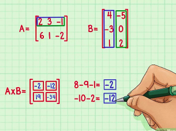

- Once you have the results of each multiplication, you should construct the resulting matrix.


## 3. Using Channels and threads

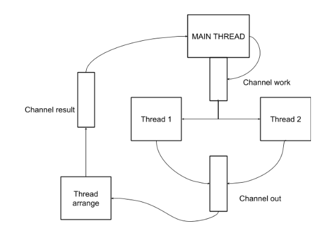

## 4. Program 

### 4.1 Initial requirements
- To use the program it is necessary to install [Racket](https://download.racket-lang.org/.
- You will need a text editor to create your text files with the matrices.
- Clone this [repository](https://github.com/alejandratub/MatrixMultiplication.git) in a new folder.

### 4.2 Text file requirements

- The text file should be a ".txt" format.

- The first line of the file should be the number of rows the first matrix has first and the number of columns the matrix has second.

- After the first line, write the first matrix.

- After all the elements of the first matrix are placed leave an empty line and repeat the  same order as the first one.


**Note: Remember that the number columns of the first matrix should match the number of rows of the second matrix**

### 4.3 How to run the program step by step 
1. In a new terminal open the folder where you cloned the repository.
2. Run racket using the command: 
    ```
    racket
    ```
3. Load the .rkt file using:
    ```
    (load "project.rkt")
    ```
4. Call the main function using:
    ```
    (matrixMultiplication)
    ```
5. You will recieve a welcome to the program, and later will be asked to enter the name of the text file containing the matrices (as specified before). Enter the name of the file using quotation marks.  

Example: 
        ```
        "matrix.txt"
        ```
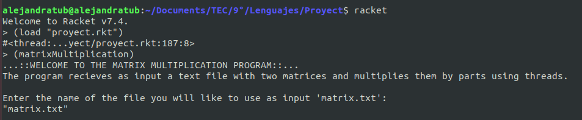

### 4.4 How the program works
1. The program reads the text file and converts it to a list. 
2. The the program gets from the list the number of rows and columns of each matrix.

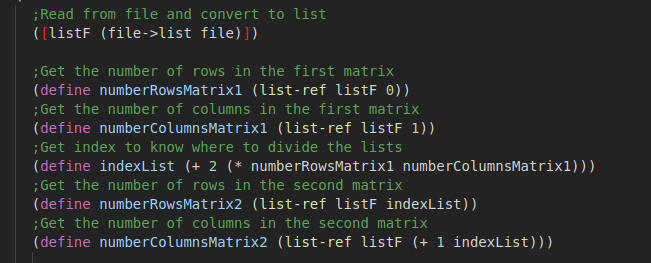

3. The program then compares if the matrices can be multiplied, if not the program ends showing a message to the user, if not it continues to the creation of matrices.

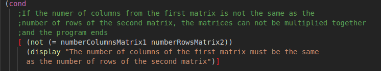
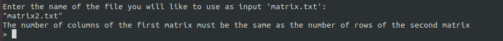

4. If matrices can be multiplied the program continues to create the matrices as list of lists, and prints them nicely to be visualized by the user.

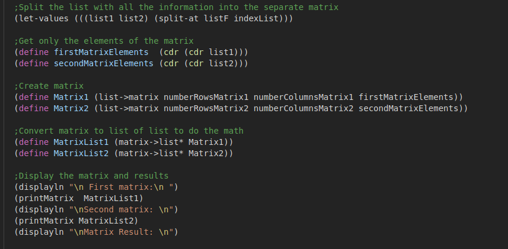
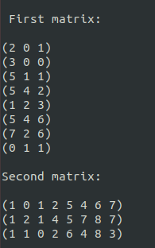

5. Create threads to separately multiply each part of the matrices.

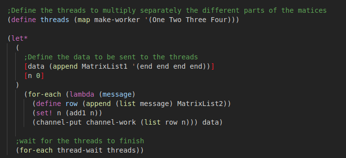
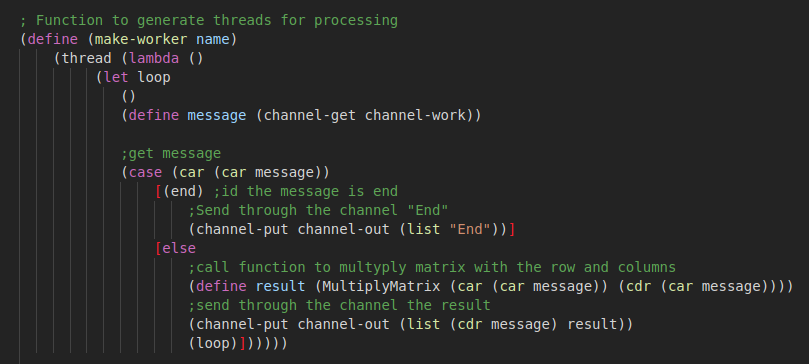

6. Return the results through a channel to a thread, to construct the Resulting Matrix with an index.

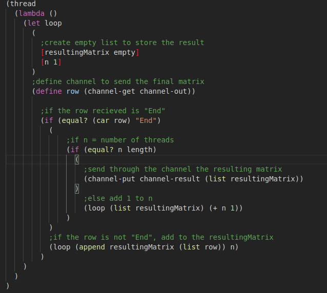

7. Sort the resulting matrix using the index number.

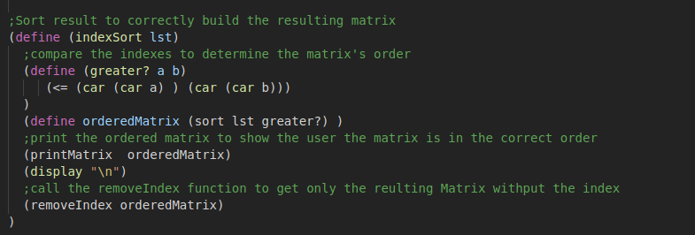
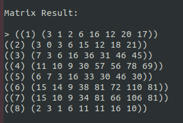

8. Remove the index to get a clean Resulting Matrix.

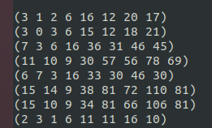

## 5. References 
1. [Racket Guide](https://docs.racket-lang.org/guide/index.html)
2. [Matrix Multiplication](https://es.wikihow.com/multiplicar-matrices)
3. [Class exaples](https://github.com/gilecheverria/TC2006)
